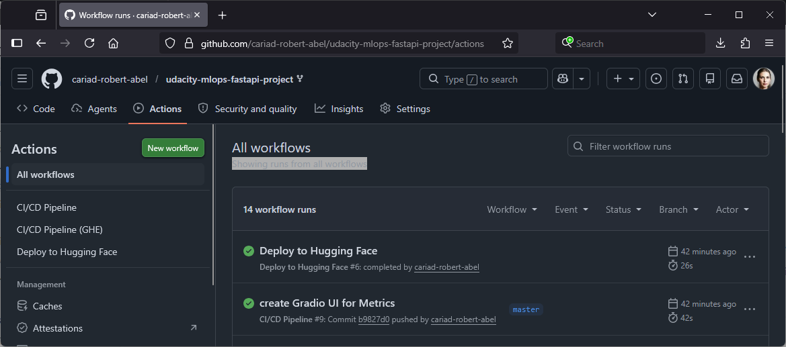
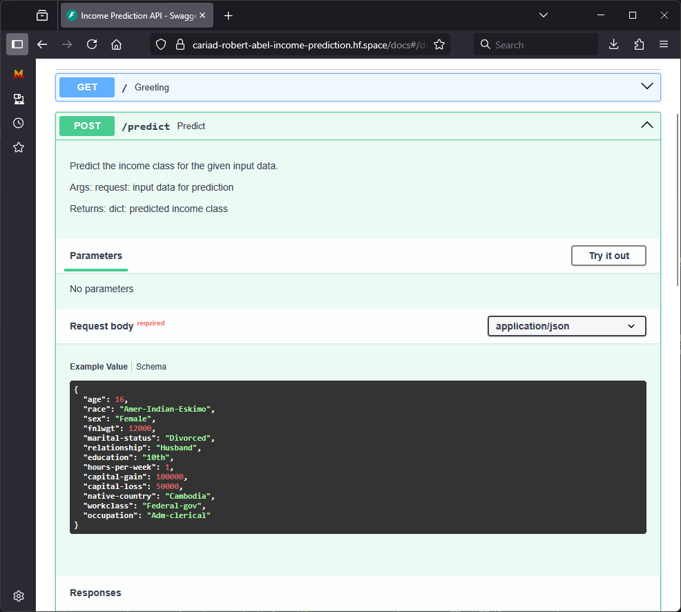
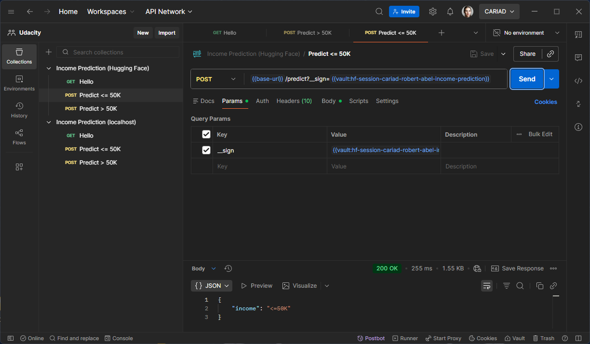
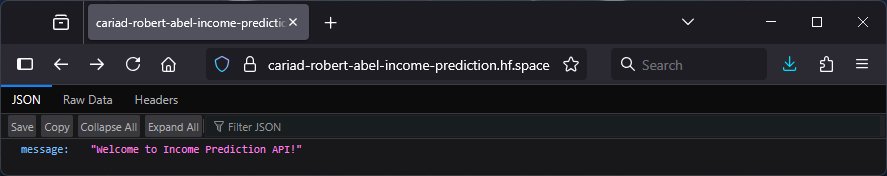
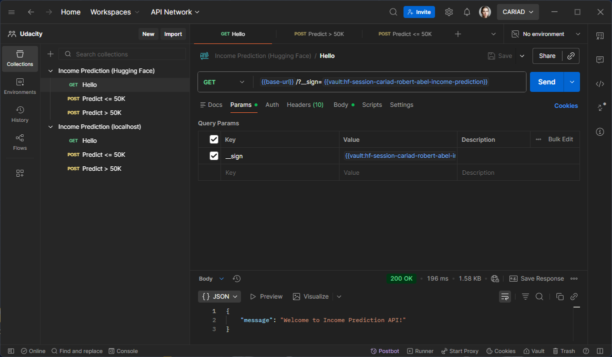
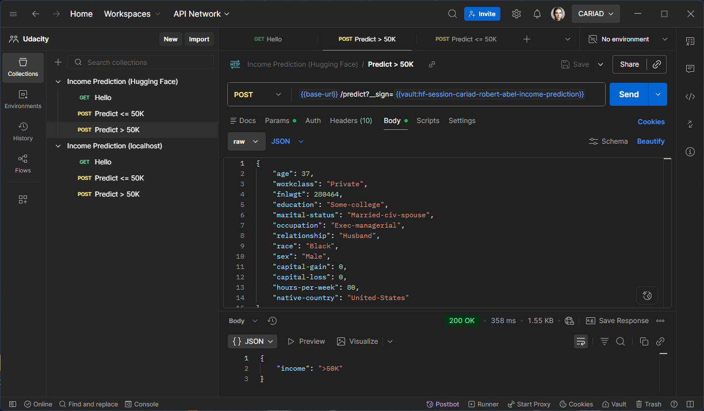
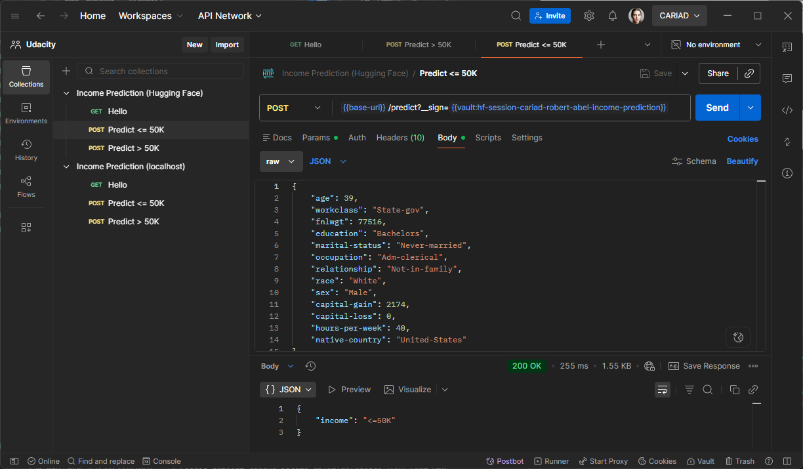
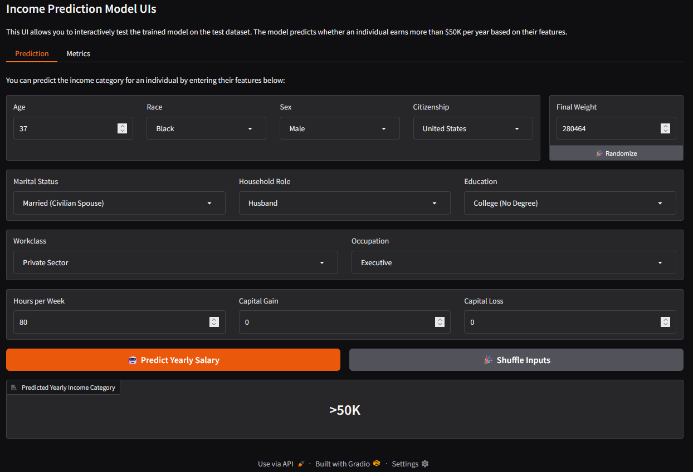
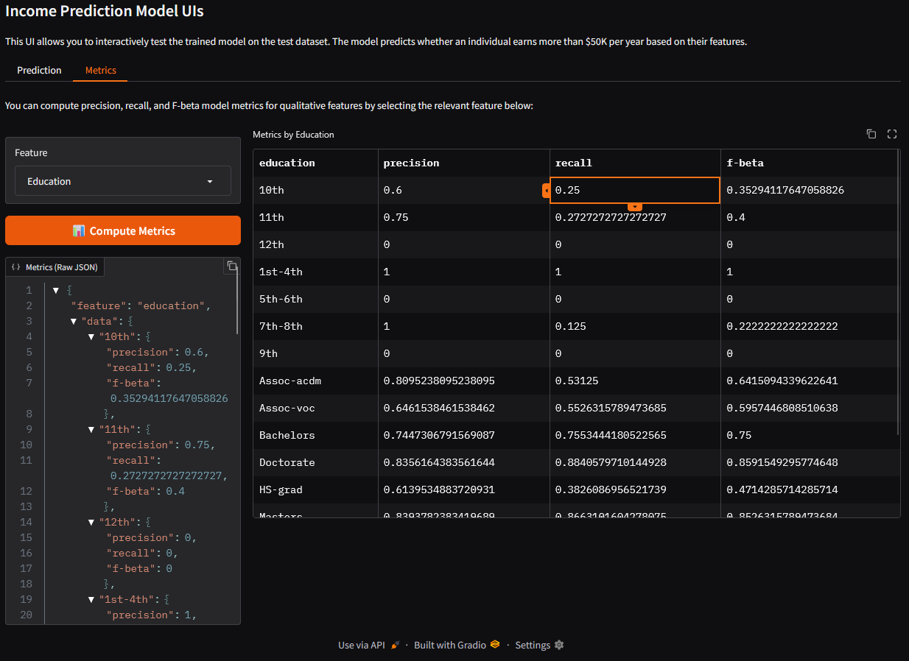

# Project Documentation

This directory contains a brief project documentation and general notes on the Hugging Face Spaces
deployment, which I learned while doing this project.

## Udacity

The artifacts required by Udacity can be found in this sub-directory.

- Passing CI/CD Pipeline:  
    
  Notice the green check marks.
- Swagger API Documentation w/ Example:  
    
  Notice the pre-filled example data in the request body.
- Live GET Request:  
  
- Live POST Request:  
  
- Model Card:  
  See [Model Card](./model_card.md)
- Slice Metrics (Education):  
  See [`slice_output.txt`](./slice_output.txt).

## Hugging Face

The deployed website can be reached at the Hugging Face Space [cariad-robert-abel/udacity-income-prediction](https://huggingface.co/spaces/cariad-robert-abel/income-prediction) resp. its direct URL https://cariad-robert-abel-income-prediction.hf.space.

.

### Access

The site is private, so you need to supply a JWT retrieved from the `/jwt` API enpoint as explained
in this [community post](https://discuss.huggingface.co/t/how-to-modify-the-fastapi-jwt-token-expiration-setting-issued-by-huggingface/78593).

The base URL for API endpoints for my space is https://huggingface.co/api/spaces/cariad-robert-abel/tinker-project.

Provide this key via the `__sign` query parameter. You only have to do this once, because Hugging
Face will store a cookie called `spaces-jwt`, which serves the same purpose as the query parameter.

You may opt to simply always supply a fresh `__sign` query parameter in any case.

### Greetings GET Endpoint

The Greetings Endpoint at `/` can be accessed either via the Hugging Face Space or the direct URL.
The REST API is best accessed via the direct URL:

### Inference POST Endpoint

The Inference Endpoint at `/predict` can be accessed via the direct URL only.
Here are POST requests showing proper prediction of >50K and <=>50K yearly salary:

### User Interface

I included a nice UI using Gradio that can be used to run inference as well as compute metrics:

