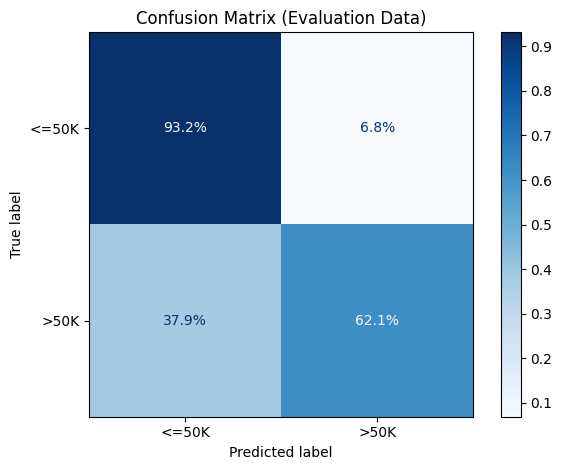
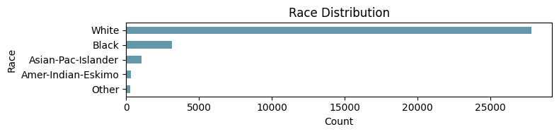
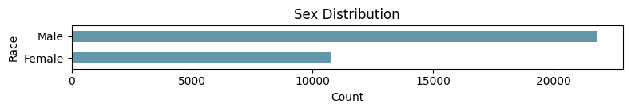
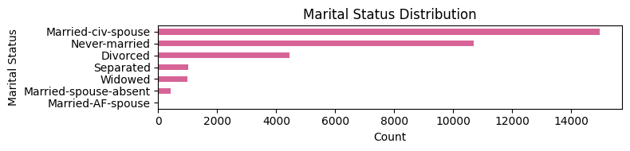
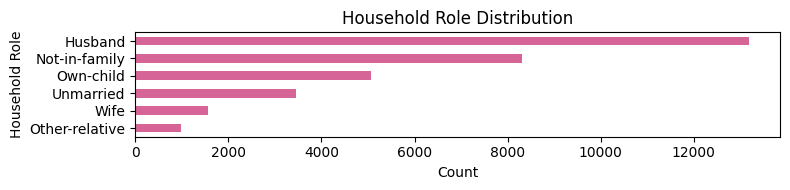

# Model Card

This is the model card for the production model of my Income Prediction project
as part of the *Deploying a Scalable Machine Learning Pipeline in Production* Udacity course.

## Model Details

The model was trained by myself based on the educational material provided by Udacity.
The model version is [income-prediction/income-prediction-model:v441](https://wandb.ai/cariad-robert-abel-cariad-se/income-prediction/artifacts/model/income-prediction-model/v441) created on 18&nbsp;May 2026.

The model itself consists of the data preparation pipeline, which consists of a simple column transformer.
Numeric features are imputed with zero whereas categorical features are imputed with a dummy string.
Categorical features are encoded using one-hot encoding ignoring unknown (w.r.t. time of training) values.

The classifier is a random forest classifier from scikit-learn v1.8.0 with the following parameters:

```yaml
# critical parameters
n_estimators: 275
max_depth: 100
max_features: 10
# default parameters
bootstrap: true
ccp_alpha: 0
criterion: gini
max_leaf_nodes: null
max_samples: null
min_impurity_decrease: 0
min_samples_leaf: 1
min_samples_split: 2
min_weight_fraction_leaf: 0
oob_score: false
```

Random seed `0x870ee45f`, c.f. [`cfg/training.yml`](../cfg/training.yml).

## Intended Use

Primary intended use is the prediction of yearly salary based on features such as `age`, `sex`, `hours-per-week` etc.
as part of this project.

However, the focus clearly fell on creating a scalable machine learning pipeline and not refining
this model's results. As such, this model shouldn't be used in any real-life setting whatsoever.

## Training Data

The model was trained on the UC Irvine Machine Learning Repository [Adult Dataset](https://archive.ics.uci.edu/dataset/2/adult) (doi: [10.24432/C5XW20](https://doi.org/10.24432/C5XW20)),
which was later re-released under the [Census Income](https://archive.ics.uci.edu/dataset/20/census+income) (doi: [10.24432/C5GP7S](https://doi.org/10.24432/C5GP7S)) name.

The original data provided by Udacity is identical in nature (incl. missing values; not accounting for row order), but
needed some cleaning before use.
See [income-prediction/census-income:v0](https://wandb.ai/cariad-robert-abel-cariad-se/income-prediction/artifacts/cleaned-data/census-income/v0).  
Notice how some columns were renamed.

The exact training dataset is `train.csv` in [income-prediction/census-income-clean:v0](https://wandb.ai/cariad-robert-abel-cariad-se/income-prediction/artifacts/cleaned-data/census-income-clean/v0).  

The data itself includes 32,561 rows of data from the 1994 United States Census Bureau that was extracted by Barry Becker
and published on 30&nbsp;Apr 1996. Roughly 76% of labels are `<=50K`, while 24% are `>50K`.

The exact fields are given in the table below:
| Field          | Type | Description         |
| -------------- | ---- | ------------------- |
| age            | int  | Age                 |
| workclass      | cat  | Workclass           |
| fnlwgt         | int  | Final Weight        |
| education      | cat  | Education           |
| marital-status | cat  | Marital Status      |
| occupation     | cat  | Occupation          |
| relationship   | cat  | Household Role      |
| race           | cat  | Race                |
| sex            | cat  | Sex                 |
| capital-gain   | int  | Capital Gain (USD)  |
| capital-loss   | int  | Capital Loss (USD)  |
| hours-per-week | int  | Work Hours per Week |
| native-country | cat  | Citizenship         |
| salary         | cat  | Target Class Label  |

Where `int` indicates a numeric integer value and `cat` indicates a categorical feature.

The training data contains 26,048 rows (80%) obtained from a random stratified split across the `salary` (label) column.  
Random seed identical to model, c.f. [`cfg/preprocessing.yml`](../cfg/preprocessing.yml).

## Evaluation Data

The exact evaluation dataset is `test.csv` in [income-prediction/census-income-clean:v0](https://wandb.ai/cariad-robert-abel-cariad-se/income-prediction/artifacts/cleaned-data/census-income-clean/v0).

The evaluation data contains 6,513 rows (20%) obtained from a random stratified split across the `salary` (label) column
of the dataset described above.  
Random seed identical to model, c.f. [`cfg/preprocessing.yml`](../cfg/preprocessing.yml).

## Metrics

The metrics used to determine model performance are recall and precision as well as their weighted
harmonic mean, F-beta (β=1). Higher is better for all mentioned scores.
The F-beta score was used to determine the model to be used in production.

| class | recall | precision | f-beta |
| ----- | ------ | --------- | ------ |
| <=50K | 93.16% |   88.56%  | 89.19% |
|  >50K | 62.05% |   74.22%  | 67.59% |

The confusion matrix over the chosen evaluation data reveals that this is mostly driven by the misclassification of the
minority `>50K` class:  


This performance would not be acceptable in a real-world application.

## Ethical Considerations

This model is trained on US Census Bureau data from 1994 and reflects social and institutional
patterns in the United States about its residents and cannot be transferred to other populations.
As a result, the model likely contains historical biases and reflects structural inequities.

Furthermore, as described above, the majority class `<=50K` is represented roughly three times as often as the minority
class `>50K` within the dataset.
As shown in the bar charts below, the dataset contains data about a predominantly white male population.
The historic grouping of races seems especially problematic.
For example, Asians and Pacific Islanders were grouped together.
Similarly, it's unclear what group represents Hispanic or Latino populations.



The dataset also contains several closely correlated columns, which should be controlled when using the model.
For example, people that *never married* should not be able to report *husband*/*wife* status as inputs to the model.



The *Final Weight* column is especially problematic, because there is little to no information how
it is actually computed and what qualities it captures. The only information given in the data is
that these weights are a control involving race, age, and sex.  
This seems insufficient to base any real-world judgment on, e.g. loan acceptance based on predicted
yearly income.

Metrics on the evaluation data sliced by categorical features show drastic difference in scores.
For example, a few select extreme `education` scores reveal considerable spread:

| education    | f-beta |
| ------------ | ------ |
| Prof-school  | 92.74% |
| Doctorate    | 85.92% |
| Some-college | 57.14% |
| 10th         | 35.29% |

See [`slice_output.txt`](./slice_output.txt) for complete data.

In summary, predictions about individuals in underrepresented groups are less reliable and should be considered suspect.
Even when used for the majority group, the outcome may be of little predictive value today given the amount of time that
has passed since the data was originally collected.

## Caveats and Recommendations

As mentioned above, performance is not acceptable in real-world applications.
The data is more than 30 years old at this point (now: 2026) and contains several obvious quality
issues, which lead to the ethical considerations mentioned above.

The model was created for the sole purpose of showcasing a scalable machine learning pipeline in
production and must not be used beyond this intended proof-of-concept use case.

Recommendation is to not use the trained model for any applications beyond education.
